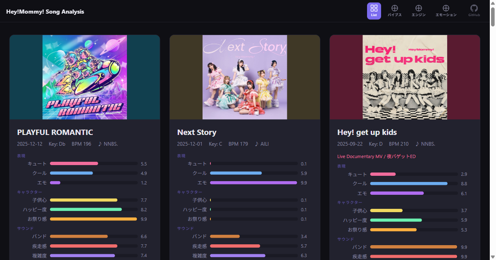

# Hey!Mommy! Song Analysis

**Hey!Mommy!** の楽曲を 9 軸スコアと 3 つのポジションマップで可視化・分析した Web サイトです。

🔗 **サイト:** <https://harapeko-wanchi.github.io/hm-song-analysis/>

---

## Hey!Mommy! について

**Hey!Mommy!**（ヘイマミー）は、振付師・槙田紗子による『SACO PROJECT!』オーディションから 2021 年に誕生した 6 人組の女性アイドルグループです。「いつまでも子ども心を忘れずに、日常に大きな HAPPY を！」をコンセプトに活動しています。

| メンバー | 担当色 |
|----------|--------|
| 原明日香 | Hey!Green!（リーダー・振付師） |
| 秋元悠里 | Hey!Pink! |
| 佐々木ひまわり | Hey!Yellow! |
| 今丘葉月 | Hey!White! |
| 延松舞佳 | Hey!Red! |
| 作島藍 | Hey!Purple! |

### 関連リンク

- [公式サイト](https://www.heymommy.jp/)
- [Wikipedia](https://ja.wikipedia.org/wiki/Hey!Mommy!)
- [X (Twitter)](https://x.com/heymommy123)
- [Instagram](https://www.instagram.com/heymommy1234/)
- [YouTube](https://www.youtube.com/@heymommyofficial8970)
- [TikTok](https://www.tiktok.com/@happyheymommy)

---

## 制作について

- **生成 AI（Claude Opus 4.6）** を使用して楽曲の和声分析・スコアリング・Web サイト構築を行いました
- 歌詞とコード進行は **[ChordWiki — Hey!Mommy!](https://ja.chordwiki.org/tag/Hey%21Mommy%21)** の情報を使用しています

---

## サイト構成

| ページ | ファイル | 内容 |
|--------|----------|------|
| **Song List** | `index.html` | 全楽曲をカード形式で一覧表示。各カードにサムネイル・9 軸スコアバー・和声解析の折りたたみ・歌詞フック・タグを掲載 |
| **ステージ・バイブスマップ** | `map-a.html` | x: かわいい ↔ かっこいい / y: 聴かせる ↔ 沸かせる |
| **サウンド・エンジンマップ** | `map-b.html` | x: エレクトロ ↔ バンド / y: グルーヴィ ↔ ハイパー |
| **エモーション・マップ** | `map-c.html` | x: 大人っぽい ↔ 子供心 / y: エモーショナル ↔ ハッピー |

### 共通ファイル

| ファイル | 説明 |
|----------|------|
| `songs.json` | 全楽曲のメタ情報・9 軸スコア・マップ座標・タグ・和声ノート・歌詞フックを格納 |
| `map.js` | 3 マップ共通のズーム/パン/ツールチップ処理 |
| `styles.css` | サイト全体のスタイル（ダークテーマ） |

---

## 9 軸スコア

各楽曲を以下の 9 軸で 0〜10 のスコアリング（probit 正規化）しています。

| グループ | 軸 | 説明 |
|----------|----|------|
| **表現** | キュート / クール / エモ | 楽曲の表現スタイル |
| **キャラクター** | 子供心 / ハッピー度 / お祭り感 | 楽曲の性格・雰囲気 |
| **サウンド** | バンド / 疾走感 / 複雑度 | サウンドの特徴 |

---

## 解析結果

`analysis/` フォルダに全 30 曲の詳細な和声分析（Markdown）が格納されています。

各ファイルには以下の情報を含みます：

- 基本情報（キー・BPM・作編曲者）
- セクションごとのコード進行と解説
- 和声的特徴の分析（転調・借用・ドミナント進行など）
- 楽曲間の比較・クロスリファレンス

---

## 全体総評

Hey!Mommy! の全 30 曲を横断分析した結果、以下の特徴が浮かび上がります。

### 作家カラーの多様性と統一感

楽曲の約半数を **NNBS.** が手がけており、グループのサウンドの核を形成しています。I7（♭7）をシグネチャーとした場面転換、I-V 始動の Verse 構造、ギター＋シンセの厚みあるアレンジが特徴的です。一方で **AILI**、**しえりーほ**、**山崎あおい** らの楽曲がエモーショナルやチル寄りの領域を埋め、カタログ全体のバランスを取っています。

### BPM と疾走感の幅広さ

BPM 118（Tickey Luppy Doo）から 210（Hey! get up kids）まで非常に幅広く、アイドルグループとしては異例のスピードレンジを持ちます。特に BPM 190 超の楽曲が複数あり、ライブでの盛り上がりを強く意識した構成です。

### 「かわいい」と「かっこいい」の両立

ステージ・バイブスマップ（Map A）を見ると、楽曲は中央やや左（かわいい寄り）に集中しつつ、右側（かっこいい）にも DIAMOND JET、Hey! get up kids、MAGNET などが展開。縦軸（聴かせる↔沸かせる）では上半分（沸かせる）に偏る傾向があり、ライブパフォーマンス志向の強いグループであることが数値的にも裏付けられます。

### エモーショナル楽曲の存在感

ハッピーでポップな楽曲が多数を占める中、Next Story、SUMI-HAJI、MAGNET、OK といった楽曲がエモーション・マップ（Map C）の下方に位置し、グループの表現の深みを支えています。特に Next Story はクール・エモともにカタログ最高値を記録し、他楽曲とは明確に異なるポジションを占めます。

### サウンド面の進化

初期楽曲からの時系列で見ると、エレクトロ寄りの打ち込みサウンドからバンドサウンドへの比重シフトが見られ、特に Hey! get up kids（バンド 9.9）や PLAYFUL ROMANTIC で顕著です。同時に複雑度の高い楽曲も増加しており、音楽的な成熟が進んでいることが分かります。

---

## ライセンス

本リポジトリのソースコードは [MIT License](LICENSE) のもとで公開されています。

楽曲の著作権は各権利者に帰属します。本リポジトリは分析・可視化を目的としたファンプロジェクトです。
